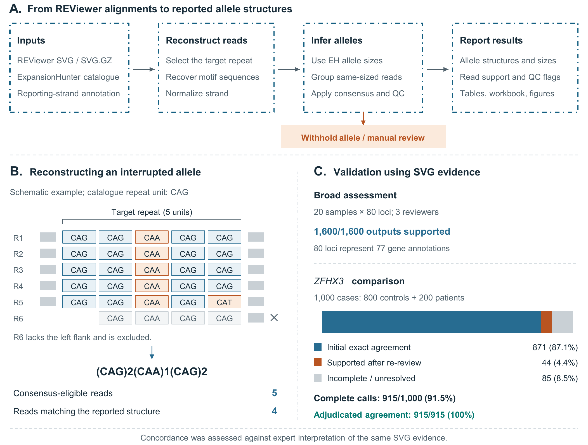

# MotifSTaR

**MotifSTaR: allele-level reconstruction and analysis of short tandem repeat motif composition**

MotifSTaR is a Python command-line tool that turns ExpansionHunter REViewer SVG files into strand-normalized, allele-level short tandem repeat (STR) motif structures. It is intended for researchers who need more than an allele-size estimate and would otherwise inspect each REViewer image by hand.

For each locus, MotifSTaR identifies the catalogue-defined repeat, finds clean reads that span the repeat and both flanks, reconstructs the observed nucleotide sequence, applies genotype-aware consensus rules, and reports the supported motif path. For example, a reconstructed sequence can be summarized as `(CAG)12(CAA)1(CAG)7`.

MotifSTaR also produces quality-control tables, read-support measures, an assisted-review workbook, read-level evidence, reproducibility metadata, and cohort- and locus-level figures. Ambiguous or poorly supported calls are marked for review rather than silently guessed.

> **Research-use notice:** MotifSTaR interprets REViewer visualizations. It is not a clinical diagnostic system, and its output should be reviewed in the context of the underlying sequencing data and study design.

## Workflow at a glance

<p align="center">
  <a href="assets/motifstar_workflow.pdf">
    
  </a>
</p>

<p align="center"><em><strong>Figure 1.</strong> MotifSTaR workflow, allele-reconstruction example, and validation overview. MotifSTaR selects the catalogue-defined target repeat, reconstructs eligible full-spanning reads, normalizes reporting orientation, applies genotype-aware consensus and quality-control rules, and reports supported allele structures with auditable evidence. The validation values describe agreement with expert interpretation of the same SVG evidence. Select the figure to open the vector-quality PDF.</em></p>

## What MotifSTaR does

- Recursively reads REViewer `.svg` and `.svg.gz` files.
- Uses an ExpansionHunter JSON catalogue to identify the biological repeat of interest.
- Uses a companion table to report motifs in a consistent reference or reverse-complement orientation.
- Reconstructs complete motif paths from full-spanning reads.
- Handles different-sized, same-sized, compound, and single-panel loci using explicit evidence rules.
- Preserves the top REViewer panel as allele 1 and the bottom panel as allele 2 when panel-specific assignment is supported.
- Withholds low-support or unresolved structures and records a plain-language review reason.
- Writes analysis-ready CSV/XLSX files and publication-oriented SVG, PDF, and PNG figures.
- Records all parameters, input hashes, software versions, counts, and run time in `run_manifest.json`.

MotifSTaR does **not** estimate the ExpansionHunter genotype de novo. It uses the allele-size labels in each REViewer SVG, unless an optional genotype table is supplied, and reconstructs the repeat composition supported by the displayed reads.

## Repository layout

```text
MotifSTaR/
├── .github/
│   └── workflows/tests.yml             # Automated tests
├── assets/                           # Workflow figure for the GitHub README
├── motifstar.py                     # Main program
├── environment.yml                 # Reproducible Conda environment
├── requirements.txt                # pip alternative
├── config/
│   ├── variant_catalog_without_offtargets.GRCh38.json
│   └── gene_strands_companion_locus.xlsx
├── docs/                             # Installation and usage documentation
├── examples/
│   ├── input/gnomad_demo/            # Five public ZFHX3 demonstration SVGs
│   └── output/README.md
├── results/
│   └── gnomad_100_per_locus_6900/    # Complete 6,900-record output
├── scripts/
│   ├── download_gnomad_str_svgs.py
│   └── prepare_public_output.py
└── tests/
    └── test_motifstar.py
```

## Installation with Miniconda

Python 3.10 or later is required. The validated release environment uses Python 3.10 and the packages listed in `environment.yml`.

### 1. Install Miniconda

Download the installer for your operating system and processor from the [official Miniconda installation page](https://www.anaconda.com/docs/getting-started/miniconda/install). The following example is for 64-bit Linux:

```bash
curl -O https://repo.anaconda.com/miniconda/Miniconda3-latest-Linux-x86_64.sh
bash Miniconda3-latest-Linux-x86_64.sh
```

Follow the installer prompts, allow it to initialize Conda, then close and reopen the terminal. On a shared computer or HPC system, install Miniconda in a directory you own and permitted by local policy. If `conda` is already provided by your institution, use that installation instead.

Check that Conda is available:

```bash
conda --version
```

Windows users can run the environment commands below in **Miniconda Prompt**. macOS users should select the installer that matches Intel or Apple silicon.

### 2. Create the MotifSTaR environment

From the repository directory:

```bash
conda env create --file environment.yml
conda activate motifstar
python motifstar.py --version
```

The final command should report version `1.4.7`.

To update an existing environment after `environment.yml` changes:

```bash
conda env update --name motifstar --file environment.yml --prune
```

See [Installation](docs/INSTALLATION.md) for Miniconda, pip/venv, Windows, Linux, macOS, and HPC notes.

## Add example input files

Place a small set of REViewer SVGs that you are allowed to redistribute under:

```text
examples/input/svgs/
  sample_001/
    sample_001.eh_realigned.reviewer.ZFHX3.svg
  sample_002/
    sample_002.eh_realigned.reviewer.ZFHX3.svg.gz
```

MotifSTaR searches the directory recursively. The usual filename must end in `.reviewer.<LOCUS>.svg` or `.reviewer.<LOCUS>.svg.gz`. If your layout or filenames differ, provide `--file-map`; see [Inputs](docs/INPUTS.md).

Do not publish identifiable participant data. For public examples, use files whose licence and consent permit redistribution, remove sensitive metadata, and document their source.

## Check the inputs first

Before a full analysis, run a metadata-only audit:

```bash
python -u motifstar.py \
  --svg-root examples/input/svgs \
  --catalog config/variant_catalog_without_offtargets.GRCh38.json \
  --annotation config/gene_strands_companion_locus.xlsx \
  --output examples/output/input_check \
  --component-mode primary \
  --validate-only
```

Open `examples/output/input_check/input_validation.csv` and resolve unexpected unconfigured loci before continuing. The output directory should be new or empty. Add `--overwrite` only when you intentionally want MotifSTaR to replace its own outputs in that directory.

## Recommended complete command

This command reproduces the analysis settings used for the reported validation runs while generating all tables and figures:

```bash
python -u motifstar.py \
  --svg-root examples/input/svgs \
  --catalog config/variant_catalog_without_offtargets.GRCh38.json \
  --annotation config/gene_strands_companion_locus.xlsx \
  --output examples/output/motifstar_run \
  --workers 4 \
  --component-mode primary \
  --min-spanning-reads 3 \
  --min-cluster-reads 3 \
  --heterozygous-interruption-min-fraction 0.50 \
  --same-size-min-cluster-reads 2 \
  --same-size-min-cluster-fraction 0.20 \
  --same-size-min-top-two-coverage 0.90 \
  --same-size-within-cluster-consensus-min-fraction 0.50 \
  --same-size-max-reported-clusters 2 \
  --same-size-max-assignment-distance 2 \
  --figure-formats svg,pdf,png
```

Why `--component-mode primary`? It reports the catalogue-selected biological target (`RepeatUnit` at the primary reference region) without appending adjacent repeat blocks from a compound locus. The program's legacy command-line default is `combined`, so the recommended biological run states `primary` explicitly.

The command-line options are explained in plain language in [Command-line reference](docs/CLI_REFERENCE.md). You do not need to specify every threshold on routine runs, but writing them explicitly makes a published analysis easier to reproduce.

## Main outputs

```text
examples/output/motifstar_run/
├── all_loci.calls.csv              # Main combined call table
├── all_loci.calls.xlsx             # Assisted-review workbook
├── all_loci.qc.csv                 # Detailed QC and evidence fields
├── input_validation.csv            # Input/configuration audit
├── run_manifest.json               # Parameters, hashes, versions and counts
├── run.log
├── calls_by_locus/                 # Compact per-locus call tables
├── read_level/read_evidence.tsv.gz # Every displayed row and its eligibility
├── figure_data/                    # Exact source data for every figure
└── figures/                        # Cohort and per-locus figures
```

`PASS` means no substantive ambiguity was detected. `REVIEW` means the call should be inspected, for example because of insufficient eligible reads, a missing expected allele, an indel-dominated target, unresolved orientation, or another QC condition. `ERROR` means the SVG could not be processed.

See [Outputs and figures](docs/OUTPUTS_AND_FIGURES.md) for field definitions and guidance on reading each visualization.

## Public gnomAD demonstration and complete result set

The repository includes a small, reproducible demonstration using five public
`ZFHX3` REViewer SVGs:

- [Demonstration SVGs and file map](examples/input/gnomad_demo)
- [Complete 6,900-record result set](results/gnomad_100_per_locus_6900)

Run the demonstration from the repository root:

```bash
python -u motifstar.py \
  --svg-root examples/input/gnomad_demo/svgs \
  --file-map examples/input/gnomad_demo/file_map.tsv \
  --catalog config/variant_catalog_without_offtargets.GRCh38.json \
  --annotation config/gene_strands_companion_locus.xlsx \
  --output examples/output/gnomad_demo_run \
  --workers 1 \
  --component-mode primary \
  --figure-formats svg,png
```

A larger population-reference analysis was performed using 6,900 public
gnomAD REViewer SVGs, comprising 100 sample–locus observations at each of 69
STR loci. MotifSTaR version 1.4.7 processed all 6,900 SVGs with four workers
in 136.1 seconds, producing 5,617 PASS calls, 1,283 REVIEW calls and no
processing errors.

These are 6,900 sample–locus observations and should not be interpreted as
6,900 confirmed unique participants. REVIEW is a quality-control outcome
indicating that one or more configured evidence requirements were not
satisfied; it is not a processing error.

The complete input SVG archive is available separately through
[Google Drive](https://drive.google.com/file/d/15PRshfYcfhfw19yqNvKGCMIB7pOLEiDr/view?usp=sharing).
The source data were obtained from the public gnomAD STR resource and remain
subject to its terms of use and citation requirements. These data should be
described as a population-reference dataset, not as a cohort of neurologically
healthy controls.

## Figures

With figures enabled, MotifSTaR generates:

- **Cohort interruption prevalence:** the proportion of resolved alleles containing at least one motif other than the catalogue repeat, with Wilson 95% confidence intervals.
- **Cohort QC overview:** the proportion of expected alleles resolved at each locus and the median supporting full-spanning read depth.
- **Interruption motif spectrum:** the frequency of non-catalogue motifs across reported allele motif paths. Counts represent motif occurrences, not numbers of participants.
- **Per-locus summary:** allele-size distribution separated into pure and interrupted structures, plus the most frequent complete motif paths.
- **Sequence-composition frequency:** exact motif paths, their motif composition, reconstructed repeat length, and number of reported alleles with each path.

The CSV files in `figure_data/` are the plotting source data and should be retained with any published figure. SVG and PDF are suitable for vector editing; PNG is rendered at 300 dpi unless `--dpi` is changed.

## Validation summary

MotifSTaR was evaluated in two complementary ways:

1. Three reviewers examined 1,600 sample–locus outputs from 20 samples across 80 configured STR loci representing 77 gene annotations. Reviewer consensus indicated that all reported structures were supported by the corresponding SVG evidence.
2. In 1,000 manually annotated `ZFHX3` cases (800 MinE controls and 200 patient samples), MotifSTaR produced complete two-allele calls for 915 cases. Initial manual annotations matched 871/915 complete calls (95.2%). Re-review of all 44 discordant complete calls supported the MotifSTaR result, giving 915/915 adjudicated agreement among complete calls and 91.5% overall two-allele callability.

In a four-worker Linux HPC run, version 1.4.5 processed 4,000 SVGs and generated tables, QC outputs, and figures in 142 seconds. Runtime varies with hardware, storage, enabled outputs, and figure formats. Version-specific performance and validation provenance are described in [Validation](docs/VALIDATION.md).

These results measure agreement with expert interpretation of the same SVG evidence. They should not be read as clinical sensitivity or specificity against an independent sequencing truth set.


## Citation

If you use MotifSTaR, please cite the software release and the associated paper when available. Citation metadata are provided in [`CITATION.cff`](CITATION.cff).

Suggested software citation before the paper DOI is available:

> Rahaman MM, O'Shaughnessy D, Zussa Z, Smith A, Henden L, Berkovsky S, Williams KL. MotifSTaR: allele-level reconstruction and analysis of short tandem repeat motif composition. Version 1.4.7. 2026.

## Licence and data provenance

A software licence must be selected by the copyright owner before the public release is advertised as reusable. This repository intentionally does not invent that legal decision; see [Release checklist](docs/RELEASE_CHECKLIST.md).

The catalogue, annotation table, and public SVG examples may have their own source and redistribution terms. Provenance for the complete gnomAD-derived result set is documented in [`results/gnomad_100_per_locus_6900/README.md`](results/gnomad_100_per_locus_6900/README.md). Equivalent provenance and redistribution information should be recorded for the configuration files before formal release.

## Contact and contributions

Bug reports and reproducible examples are welcome through GitHub Issues. Please read [`CONTRIBUTING.md`](CONTRIBUTING.md) before proposing code changes. Do not upload participant data, private SVGs, or identifiable paths to an issue.

When the release checklist is complete, follow [Publishing on GitHub](docs/GITHUB_UPLOAD.md) to create or update the repository and tag the version used by the paper.
